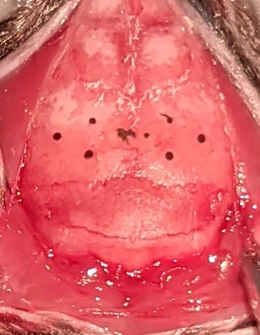
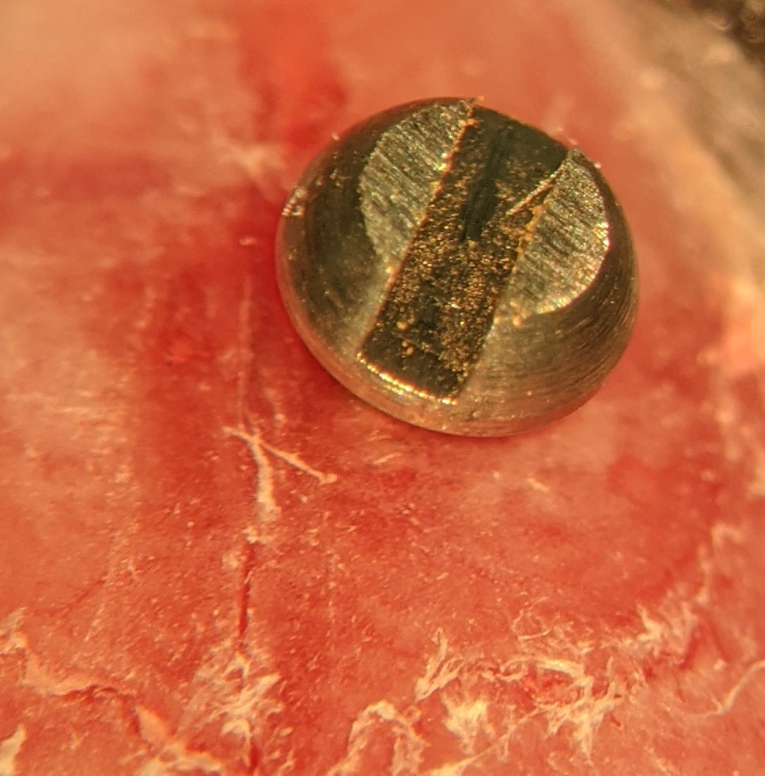
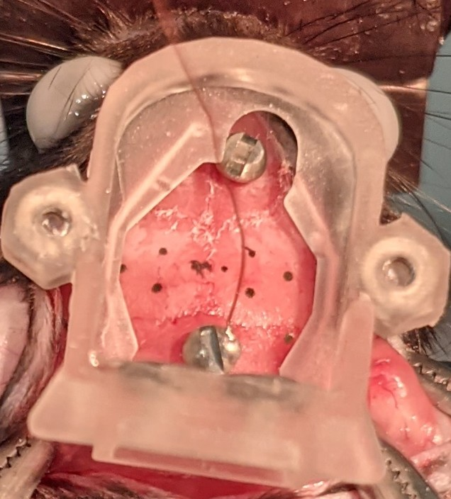
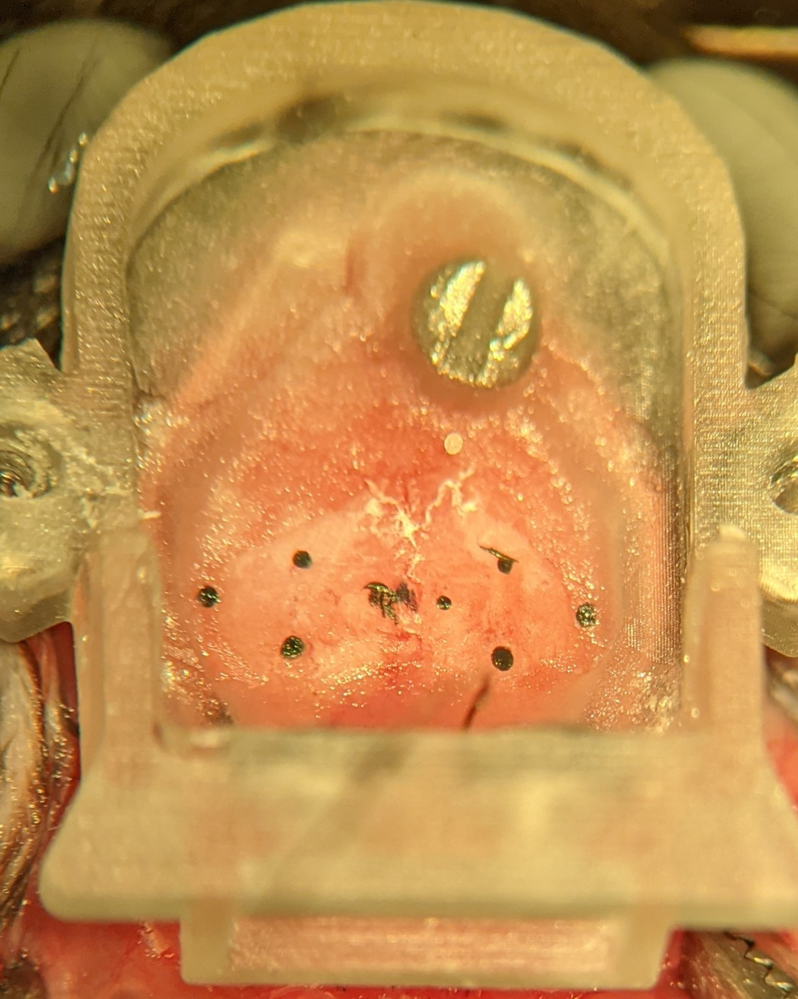
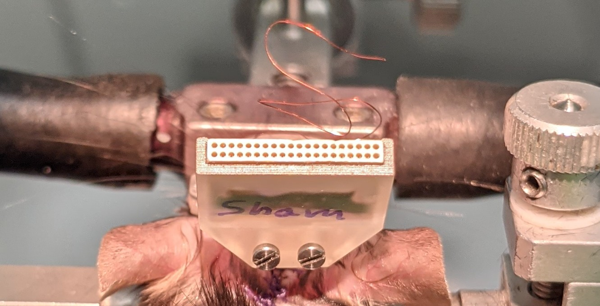
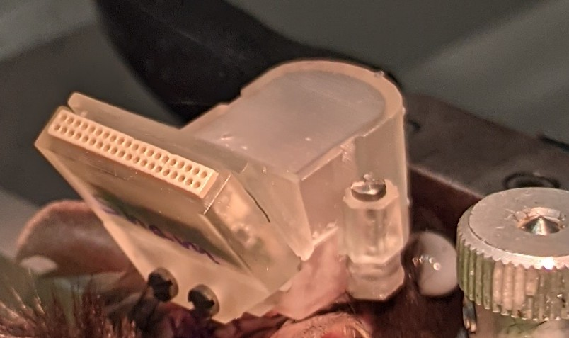

# Base implantation

## Material to prepare

* Make sure you added the [4 nuts to your base](prepare_base.md) before starting this procedure.
* One ground screw and an additional screw that has been shorten at both ends by a few 0.1 mm with the dremel.
* A microdrive holder with an attached microdrive. There should not be any probes mounted on the microdrive.

## Potential problem to avoid

One critical point when cementing the base to the skull is to make sure that you will have all the space needed to implant your microdrive later on. 
To make sure this is the case, I attach a microdrive with its case to the microdrive holder and position the microdrive at the coordinates needed for probe implantation.
I cement the base with the microdrive at the implantation sites. This ensure that the microdrive will fit in the base when we will do the probe implantation.

## Prepare the animal
* Set the isoflurane to 2.5%
* Place the animal in the induction chamber for approximately 15 sec or until it is not moving and does not stay upright when tilted sideways.
* Fix the animal to the stereotaxic frame
* Set the isoflurane to 1.5-2%.
* Cut the fur on the head, from the neck to between the eyes.
* Remove any hair left.
* Apply a cream to protect the eyes (Bepanthen, Augen under Nasensalbe MIT 5% Dexpanthenol, Bayer).
* Clean the skin with an antiseptic (Octeniderm)
* Apply xylocan (Pumpspray, AstraZeneca) to the skin that will be cut and wait 3 minutes.
* * Open the skin with scissors. One single straight cut is the goal.
* Retract the skin sideway with hemostats. Be careful not to touch the eyes.
* Remove soft tissue covering the skull with a scalpel
* Cut the muscle attaching to the top of the bone at the back of the cerebellum. This is done with two cuts starting at the midline, one towards left and one towards right. Remove any soft tissue on th eskull. There should be no muscle left at the posterior edge of the skull.

## Mark your implantation sites

* Install an arm with a fine needle on the stereotaxic frame to measure the coordinates on the skull.
* Make sure bregma and lambda are levelled in the DV and AP axes. 0.1 mm difference is ok but not more.
* Have a look at the general orientation and position of the head without the microscope. If the head does not look straight, it probably isn't and try to align it.
* Find the AP and ML coordinates of bregma. and write tem down.
* Calculate the coordinates of your implantation site. 
  * Hippocampus CA1 : AP: -2.0 mm, ML: 1.7 mm
  * ADN AP: -0.9mm, ML: -0.8mm
  * MEC: ML: 3.1 mm, AP: 0.2mm from the transversal sinus and 5 degree angle toward posterior.
* You might want to reduce the isoflurane to 1.25-1.5%

## Mark the site for the ground and anchor screws

* Place the base on the skull at the approximate correct location.

* Use the microdrive holder to put the microdrive at the correct place, as if you wanted to implant probes.
* Make a mark with a pen for the anchor and ground screws. There is a hole in the base for the anchor screw. Make sure you are not placing the screw in a bone fissure or above a sinus.
* Move the microdrive away and remove the base

## Drilling and fixing the anchor and ground screw

You need to add one anchor screw at the front and one ground screw at the back. The anchor screw at the front need to be shorten to make sure it does not prevent us from lowering the microdrive later on. To shorten it, use a dremel and cut 0.2 mm at the bottom and at the top.

* Choose a small drill bit, set the drill in the forward mode.
* Drill a hole for the anchor and ground screw. Start with a smaller hole and test if you can insert the screw. If not, make the hole larger and repeat.
* Insert the anchor screw so that it does not come out too much from the skull. I normally use the dremel to shave a few 0.1mm from the screw (as on the picture).
 This will allow you to lower the microdrive further down when implanting the probes.
 
 

 * Inser the ground screw.
If you plan to implant the probe in the same surgery, drill most of the skull above your implantation site. Only leave a thin layer of skull that can be removed later.

## Cementing the base

* Bring back the base to the appropriate position. Make sure the ground wire is going in the hole of the base.

* Place the base in the correct position. Use the microdrive to make sure your are not placing the base at a position that would make the probe implantation difficult.
* Add some cement at junction of the base and the skull. Apply the cement only from within the base. The cement should flow under the base to grip the skull, but it should not flow into the skin or muscles. 
* Wait 5 minutes and move the microdrive away so that you have more space to apply the cement.

* Wait 15 minutes for the cement to solidify.

If you are implanting the probe in this surgery in addition to the base, go [here](https://github.com/Mrymna/Surgery_procdures/blob/main/Neuronexus/implantation.md).

## Suturing

* Use saline to clean the skin around the base.
* Sew stiches to close the wound. Normally, you need 3 stiches at the back and 1 at the front.

## Add the pcb plate

* Mount the pcb plate to the base. Try not to apply too much force on the plate or on the head of the animal.

## Add the lid

* Attach the lid to the base. Make sure that the ground wire is not coming out of the base-lid assembly.

## Carprofen injections

* Prepare your injectable solution of Carprofen.
* Inject 0.4 ml of Carpofen solution under the skin.
* Give the animal an additional injection every 24 hours for 2 days.

## Return to the home cage

* Move the animal back to its home cage. Make sure it has water available and perhaps some food directly in its cage.
