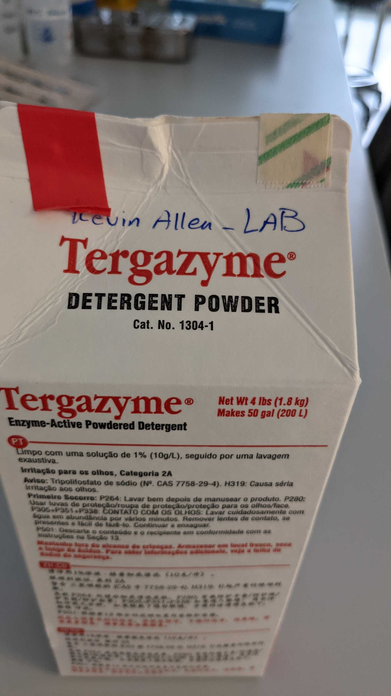
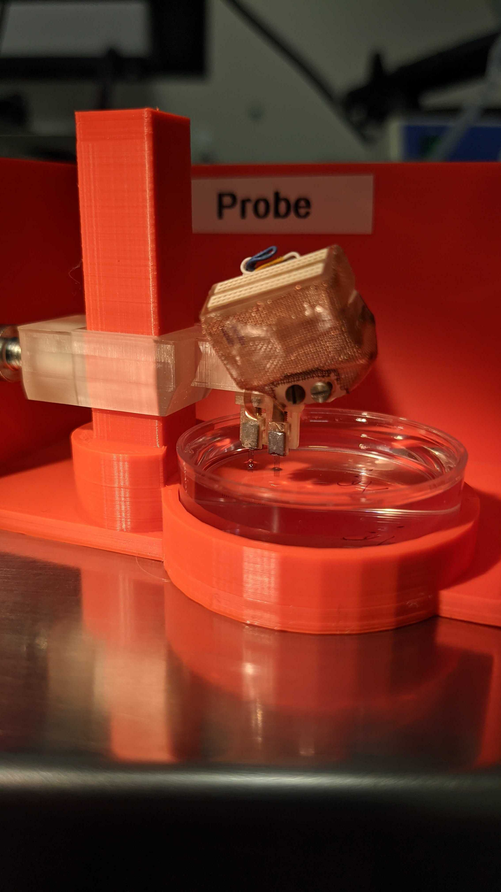
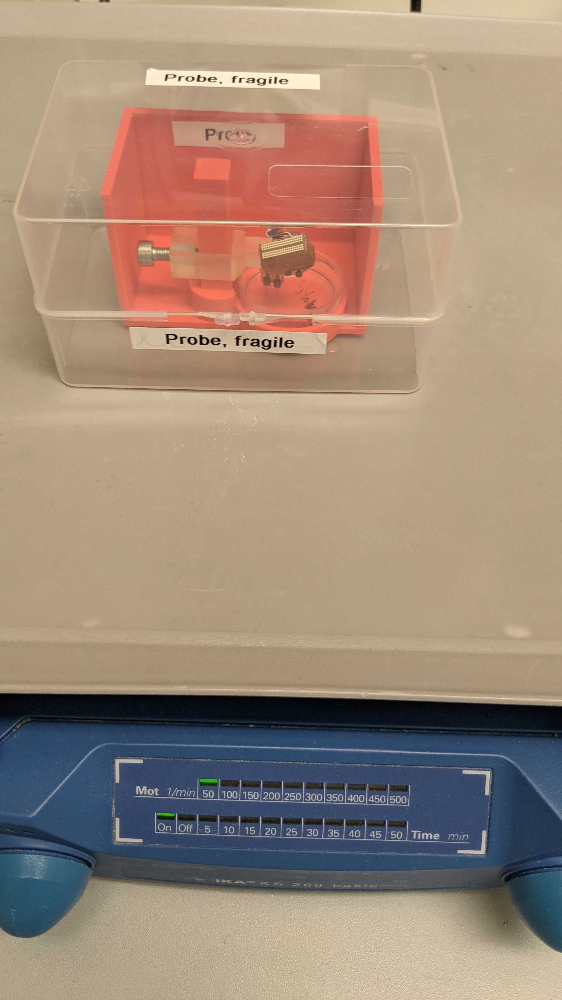
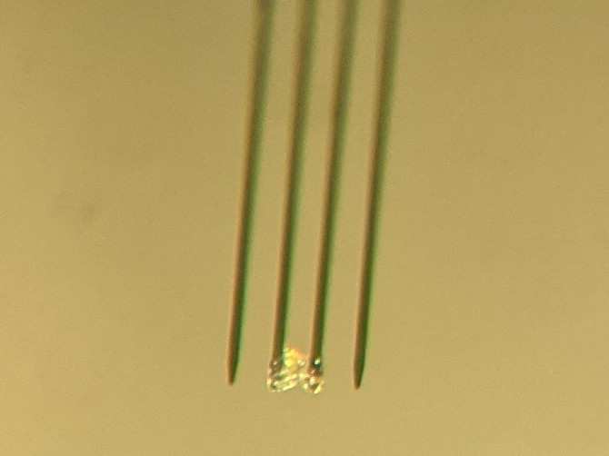
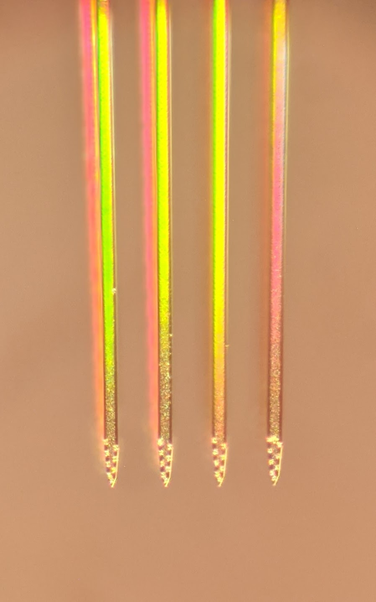

# Cleaning procedure for Neuronexus probes

Leave the probe on its post so that it is protected as much as possible.

## Preparation of a Tergazyme solution

Tergazyme is a concentrated, anionic detergent with protease enzyme for manual and ultrasonic cleaning. Excellent for removal of proteinaceous soils, tissue, blood and body fluids from glassware, metals, plastic, ceramic, porcelain, rubber and fiberglass with no interfering residues. Ideal as a cleaning agent in Reverse Osmosis and Ultra-Filtration Systems. USDA authorized. Dilute: 1:100. pH 9.5
The Tergazyme powder is next to the hood opposite to the ice machine.

* Solution: 0.4 g of Tergazyme powder into 40 ml of distilled water. You can use the balance opposite to the Nissle staining hood. Put it on the stirer for 10 minutes.

## Cleaning the probes

* Put the probe back in the protective case, with a plastic cup (pool) below it.
* 
* Add the Tergazyme solution to cover approximately 1/3 to 1/2 of the shanks of the probe.

* Put the probe on the shaker at 50 revolution per minutes and let it shake overnight (approximately 12 hours).

* Remove the Tergazyme solution and add distilled water to cover most of the shanks to remove any detergent or residue. Put it on the shaker at 50 RPM for 30 minutes. Remove the water.

* Repeate the previous step 2 times.

* Remove the water from the pool, raise the probe, and remove the pool from the holder.

## Verify that the probes are clean and not stuck together

After 3 washing cycles, your probes should be perfectly cleaned. Have a look under the microscope to make sure there is no tissue or crystals left on the probes. You might want to rotate the probe by 90 degrees on the post to make sure the recording sites are clean, but leave the probe on the post as it is safer there than in your hands.

**If crystal forms on a shank, you can try to dip the probe is warm water (~60 deg celcius).**

If after removing the water from the pool, some probes are stuck together because of water, put the probes under the microscope. Take a small piece of paper tissue and bring it to the body of the probe (PCB part, not the shanks if possible). The water should be sucked by your tissue and the probes will separate themselves. This is less dangerous than touching the probes themselves.

See the figure below for examples of dirty and clean probes. You don't want to let a dirty probe dry as this might compromise your recording sites.

Your probe should not look like this. If they do, try dipping them in warm water (~60 deg celcius). If you still have crystals, heat destilled water in the microwave so that it just about starts boiling (~20-25sec). Let it cool down until you can touch the recipient with your hand and dip the shanks into it briefly. Repeat several times if needed.

It should look like this one.

## Storage of the probes

* Leave the probe in its protective case and store it in a safe place. It should be stored in a closed case so that there is no dust accumulating on it.
