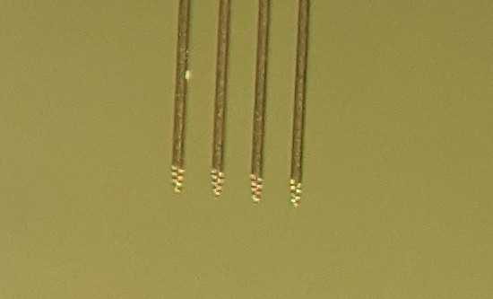
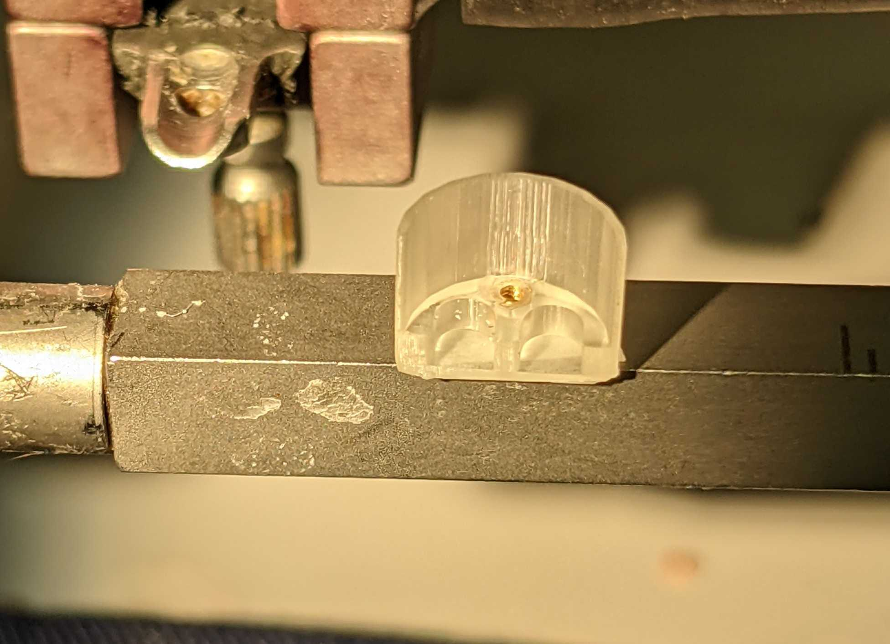
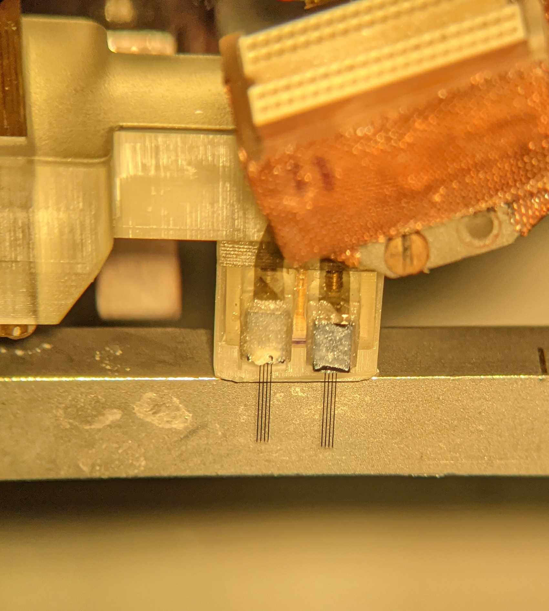
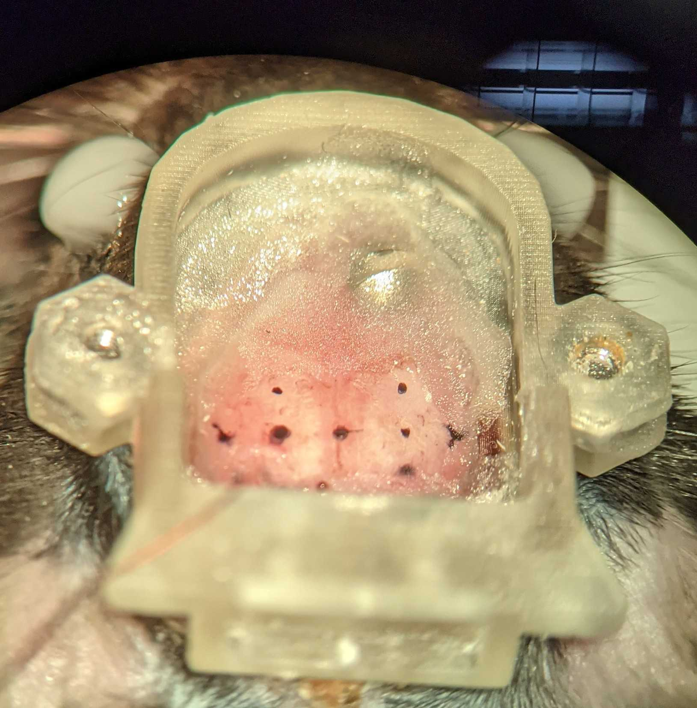
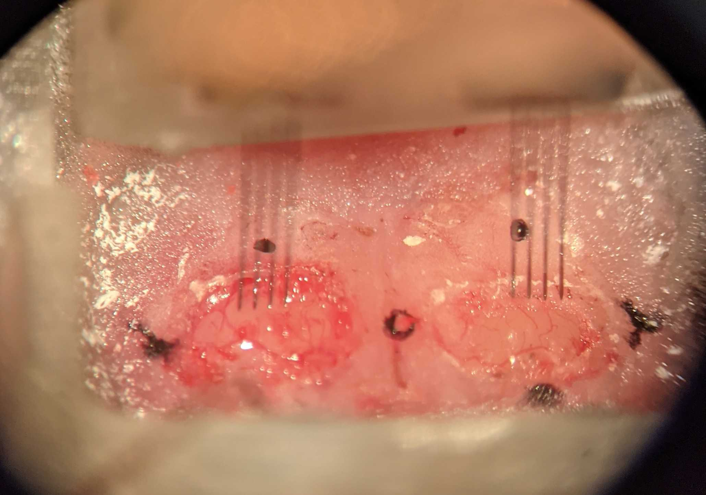
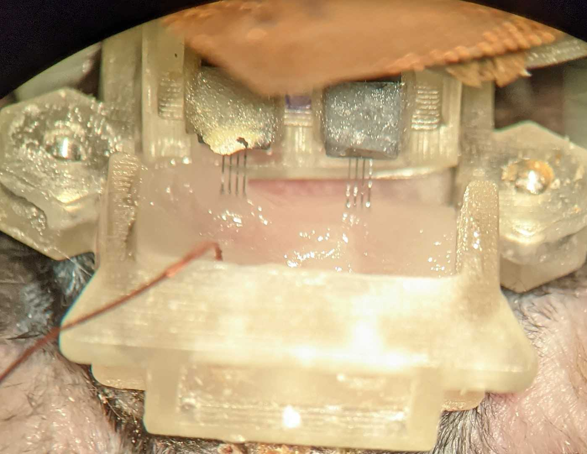
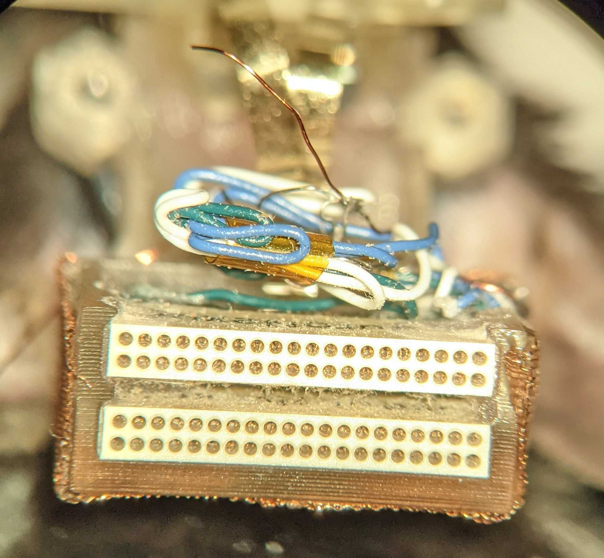
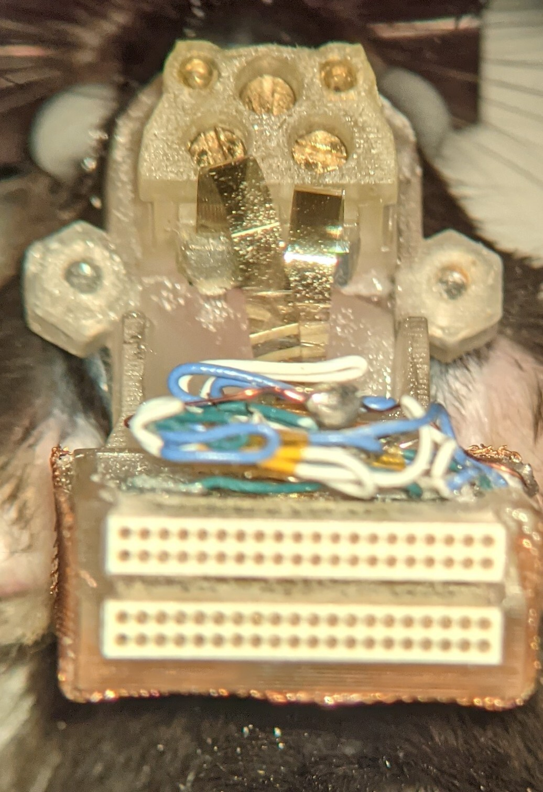

# implanting two 32ch Neuronexus probe in Hippocampus ca1 region
## checking the probe
* look at the probes under the microscope and make sure that they are clean. you should check the recording sites.

## mounting the case for the microdrive 
* place the case on the streotaxic ear bar using two sided tape. you should have the screws on the drives before moving sown. 
* lower the microdrive until you are so close to the case. 

* screw the two parts together. always look at your probes so you dont accidentally distroy them. you can feel when the screws go to the nuts. 
* trun the screw enough that it can holds the drive and at the same time if you put so much pressure you are going to distroy it. 
* the probe should be almost at the top position. almost 1-2 turn from the top. 

* the screw that is located the one towards you is the one you should turn. the other one at the back is releasing the probe from the drive. 
* Move the probe out of the way and bring the animal. 
* put some vaseline on the eyes of the animal. 
* remove the lid and the pcb board. 
* make sure that the skull of your animal is approximately flat. 
* you can use the compress air to clean the skull. 
* add some saline to the skull to make it wet. 

* before drilling you need to check if the probes are fitting in and if not you need to do some readjustment. 
* check if the probes are arrivng with the same hight on the skull. 
* Drill the implantation sites. its important to not damag the dura or the brain. 
* remove the dura with little possible damage that is possible! 

* remve the blood with spoge or tissue before puting the probes. 
* lower the prbe about 0.3 um below the surface of the brain. 
* now you need to put the liquid melted wax on top of the brain.

* make sure you have enough space for the shuttles to go down.
* Now you can add cement. start adding cemant at the front. 
* make sure tha the cement does not touch the probe. 
* add cemant to the outside wall of the case to attache it to the base. 
* look regulary to the probes to make sure you are not cementing the probes. 
* move the pcb plate to the base. this is the most delicated part you need to hold the plate with your finger while moving it to the base.
* start tightening the screws to the base. but do not put so much pressure since its possible that you move the head and bend the probes. 
* you have to be careful since there is always the possiblility to move the head while screwing the pcb back to the base. 
* the next step is to solder the ground wire to the point where you had the wire before. 

* make sure while you are soldering the qround wire dont touch the probe. 

* now you should disconnect the holder. Make sure you are unscrewing the right screw. 
* release the drive and move away the holder. 

* now you can add the lid with the right height. (09 mm)
* you may also want to inject 0.4 ml of diluted carpofen with saline to the mouse. 
* Now you can check the signal in the recording room and see how does that look!
* have fun with your recording :D 

