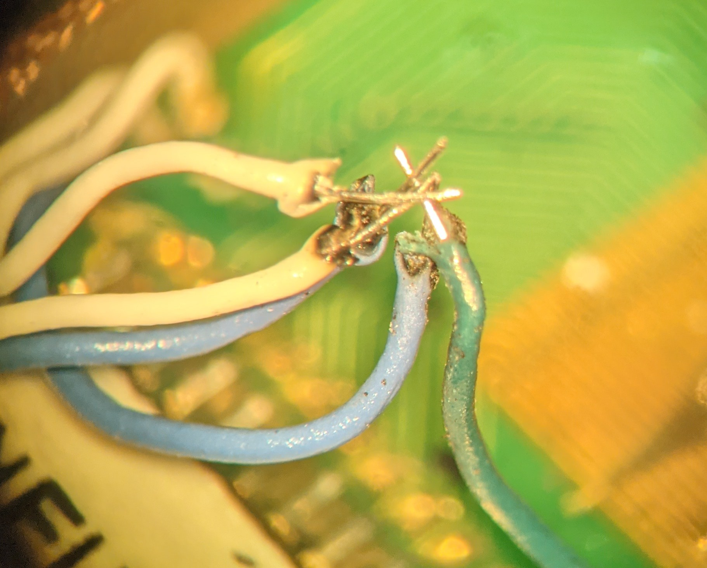
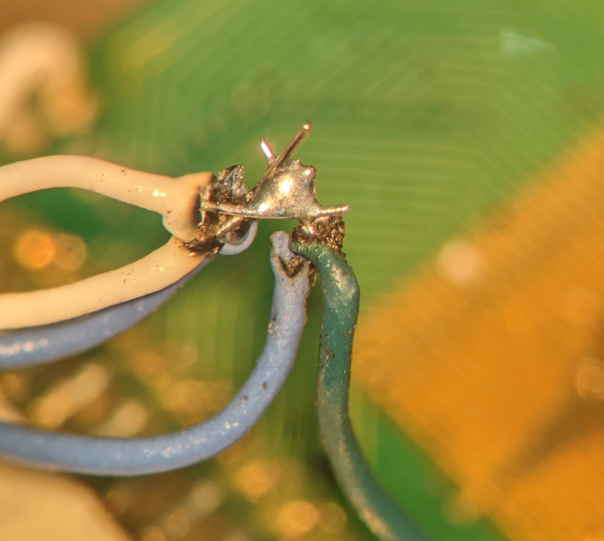
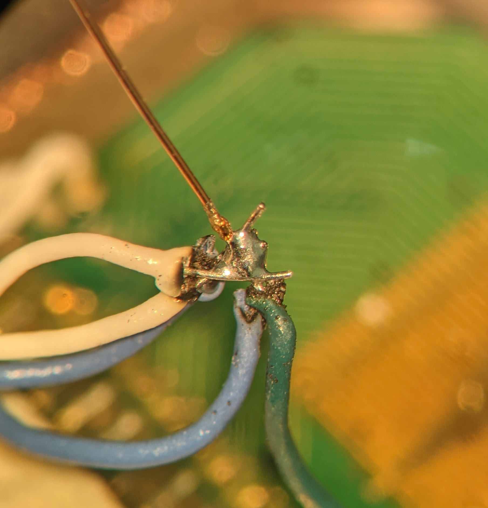
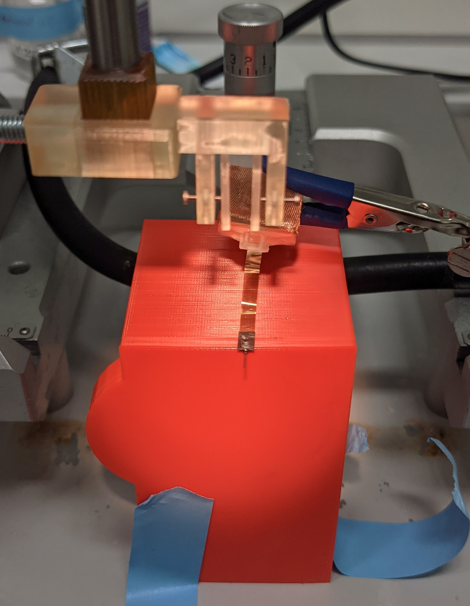
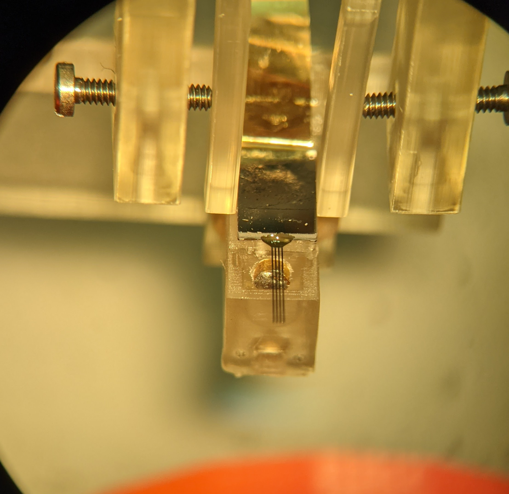
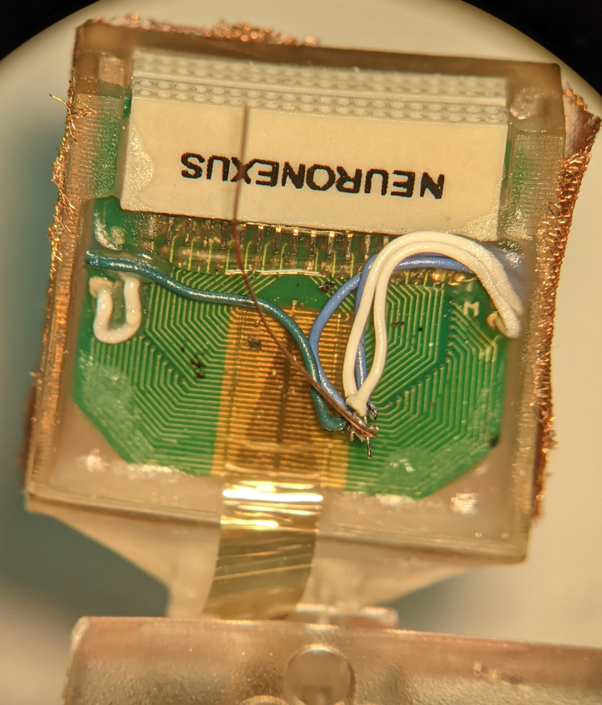
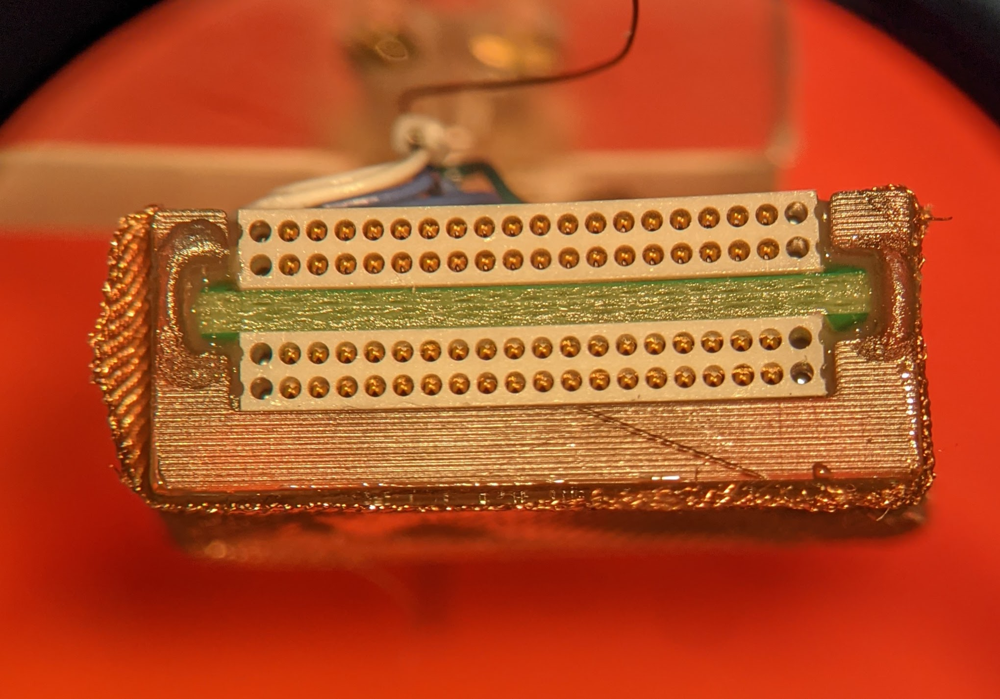

# Mounting the probe onto the microdrive

The procedure will vary depending on the specific probe and the microdrive configuration.

We are still improving the procedure to reduce the risk of damaging the probe during these steps.

## 1 x 64 channel probe on single-probe microdrive

This was a configuration we use to establsh recording for the MEC.

### Add the PCB to the PCB plate

1. Prepare a [PCB holder plate](prepare_pcb_holder.md) with copper shielding.
2. Mount the PCB of the probe in the PCB holder plate. I had to insert the PCB from the bottom of the PCB holder plate.

### Solder the ground and reference wires of the PCB

1. Remove the insulation of the reference and ground wire by melting them with solder at 450 degree and removing the burnt plastic left.
2. Place the exposed wire so they touch eachother. 

3. Add some flux to the contact points and solder the wires together.

4. Add a short (2 cm) copper wire. This extra copper wire can be used during surgery to solder the ground screw wire without risking to separate the reference and ground wires of the PCB.
 

### Determine the probe orientation

The orientation of the connector and probe is important as you will need to map the probe channels to the amplifier channels.
The orientation also determines which shanks are lateral or medial.
Take pictures or notes of what you are doing and always keep the same orientation. 
This will simplify your data analysis.

In the case of 1 X 64 probes, we rotate them so that the shanks are closer to the shuttle.
The recording sites should not visible from the back of the mouse. 

### Grab the probe with a holder

The best way to manipulate probes that have large PCB is with a printed probe grabber attached to the stereotaxic frame. Attach the probe connector to the back of the probe grabber.
Grab the probe in the top 1/3 if the probe PCB.
 

### Place the probe on the shuttle

1. Put you microdrive on its holder, ideally in its protective case.
2. Put the probe on the shuttle.

 

### Cement the probe to the shuttle

1. Make sure the probe is straight.
2. Add some cement between the shuttle and the probe. If the cement is liquid enough, the capilary effect will move the cement between the shuttle and the probe.
3. Immediately after adding the cement, you can make any final adjustment of the probe position if needed.
4. Wait 10 minutes
5. Release the probe from the probe grabber.
6. Move the probe grabber away

### Attach the PCB holder to the microdrive holder

### Cement the PCB in the PCB holder

Make sure you do not put any cement in the pin holes of the connectors.

 
 

