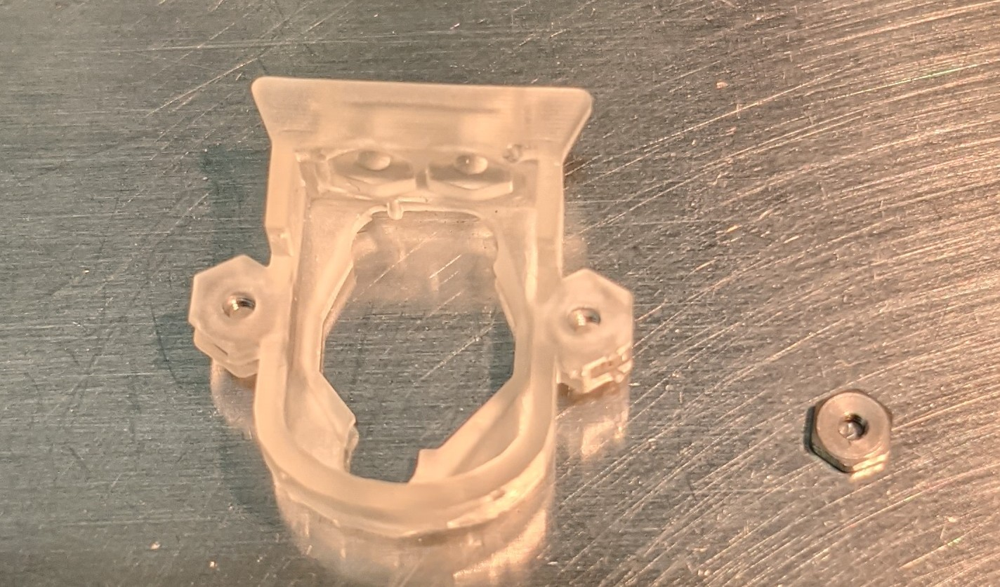

# Prepare the base

The base is the part that you will first cement to the skull of the animal. It will surround your microdrive. At the back of the base, you can attach the pcb plate. On top of the base, you can add the lid.

You first need to add a 4 nuts to the base to be able to attach the pcb plate and lid to it. There are small slots where the nuts should fit in. 

## Add 2 nuts for the lid

*  Use a dental drill to remove any resin that might block the nut from fitting perfectly into the slots.
*  Add 2 nuts for the lid in the base.

*  Attach the lid to the base with 2 screws.
*  With the lid solidely attached to the base, add cement to completely cover the nuts in the base. Be careful not to cement the lid to the base.
*  Wait 15 minutes
*  Remove lid from the base

## Add 2 nuts for the pcb plate

*  Add 2 nuts into the slots where the pcb will be attached. 
*  Attach the pcb plate to the base with 2 screws.
*  Add cement to secure the nuts to the base. Make sure that these nuts can't move or you could destroy your probe at a later stage.
*  Wait 15 minutes
*  Remove the pcb plate.
