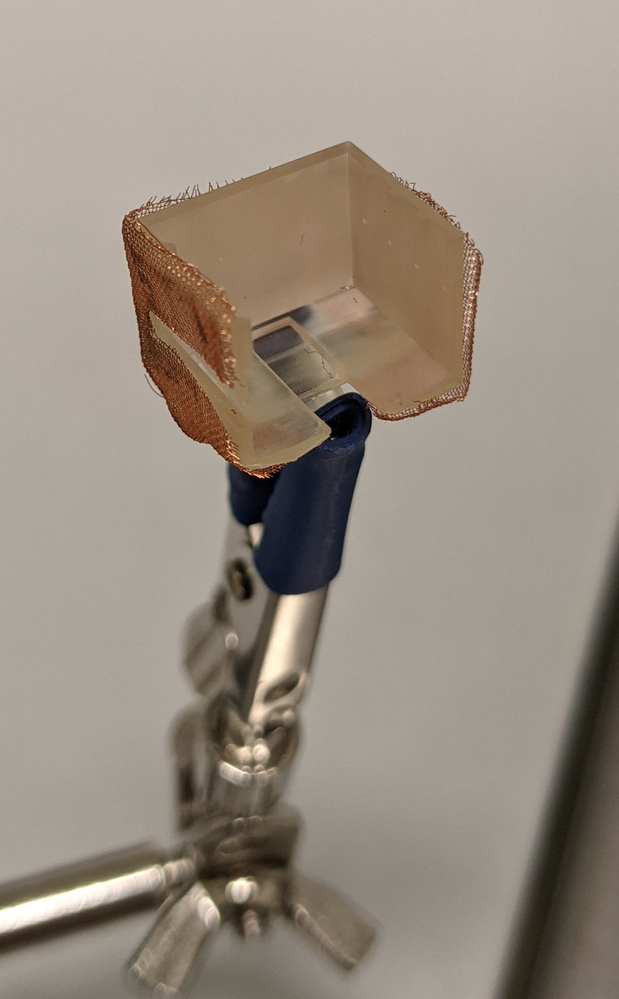

# Prepare the PCB plate

## Materials

1. PCB plate (printed)
2. Copper mesh

## Steps

1. Cut the copper mesh so that it fits the shape of the PCB plate. You need to cover only the outside and only the vertical walls.
2. Place the copper on the PCB plate.
3. Use epoxy glue to glue the copper mesh to the plastic. Leave 2x2mm of copper mesh exposed (not glued) to solder a ground wire later on. 
4. Make sure you don't use too much glue as this increases the weight of the headstage.

4. Solder an isolated copper wire to the mesh and leave approximately 4 cm of wire. This will be connected to the ground of the amplifier.
