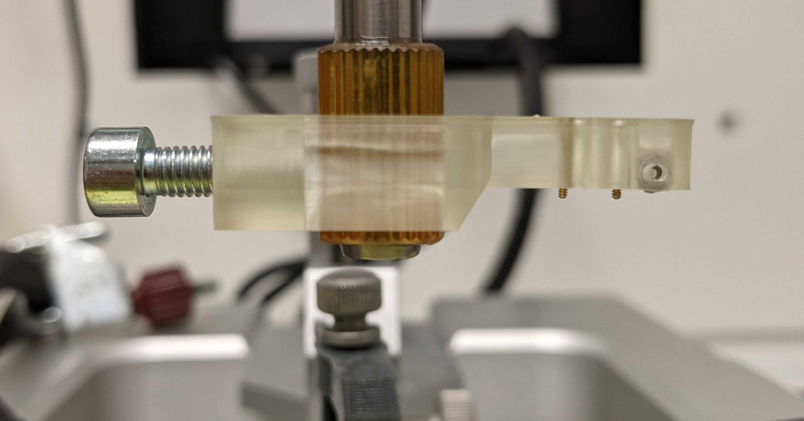
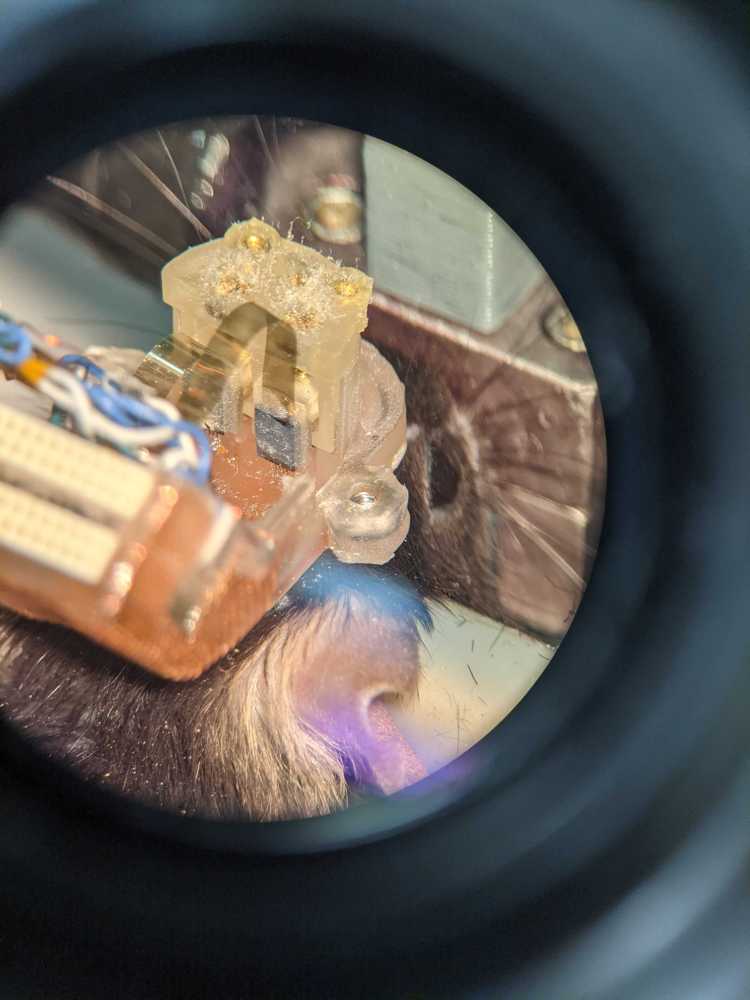

# Recovery of the implanted neuronexus probe

## Prepare the cleaning solution
* If you plan on recycling the probes, prepare the [Tergazyme solution](cleaning.md).

## Prepare the stereotax for the surgery. 

* Attach the drive holder ot the stereotaxic frame. 
* Place the animal's head in the stereotaxic frame. Make sure the head does not move or you might damage the probes later on. For instance, if you can see the head and microdrive moving when the animal is breathing, you need to correct this. The head should not move.

## Prepare the recovery of the drive 
* Remove the lid by removing the 2 screws. Move the lid vectically to ensure you do not break anything. 

* Remove any dust with compressed air (gently).
* Cut the ground wire which is attached to the ground screw (not the one coming from the pcb plate shield). Leave a long part of the cable on the PCB side so that you know where to connect the ground of the next animal. Make sure you do not cut anything else.
* If the probes are completely in wax, you can try to heat up the wax slightly to make sure lateral movement of the probes does not damage the probes. I used the soldering iron and just get closer to the wax. Do not approach the probes or microdrive with the soldering iron.
* Raise the shuttles so that they are almost completely up. This will free part of the probes and make it less likely that you damage them when you deattach the microdrive from the base.
* Make sure that the bottom of the microdrive holder and the top of the microdrive are parallel planes so that they come nicely together as you lower the holder.

## Microdrive-holder coupling

We now need to attach the microdrive to the holder. The two screws at the front of the holder needs to be attached to the 2 nuts at the front of the microdrive.

* Lower the microdrive holder to get close to the microdrive. The arm of the stereotaxis frame should have the same angle as the one used during implantation so that the shanks go up the same way they went down. 
* Make sure the screws are aligne with the nuts of the microdrive. The best way is to look from above and make sure the holes are aligned with the screws.
* There are two screws to reattach the drive to the holder. Gently screw them clockwise. Look at the probe that nothing unexpected happen. **Do not apply strong force on the screw as this could damage the nut or the microdrive**. 

 ### If you have problems getting the screw to catch the thread of the nut
 
 Try the following:
 
 * Make sure that the microdrive holder is flat with the microdrive. 
 * You can try to move sideways a few 0.1 mm. 
 * If you can't get the screw to catch the thread and you suspect that the screw can go down enough to catch the nut, you can remove some materials with a drill bit to allow the screw to be slightly lower in the microdrive holder. 

## Moving away with the microdrive

* Disattach the microdrive from the casing of the drive which is cemented on the skull. This is the screw in the middle.
* Slowly raise the microdrive until the probes are out of the wax. The probes should be few mm in the air so they can freely move without being damaged.
* Move the probes so that they are almost 1 cm from anything. Also, take care that the ribbon does not touch the probes.

## Attach the pcb holder to the microdrive holder
* Disattach the pcb holder from the mouse and attach it to the holder. Use the left screw on the pcb to attach it to the holder. Make sure you don't pull on the ribbon cables and that you do not clamp them between pcb and the holder.

## Next steps

* Immediately place the probes in the cleaning solution. The cleaning protocol can be found [here](cleaning.md). The Tergazyme solution will also remove wax remainings attached to the shanks.
* Perfuse the animal if you need histology.
